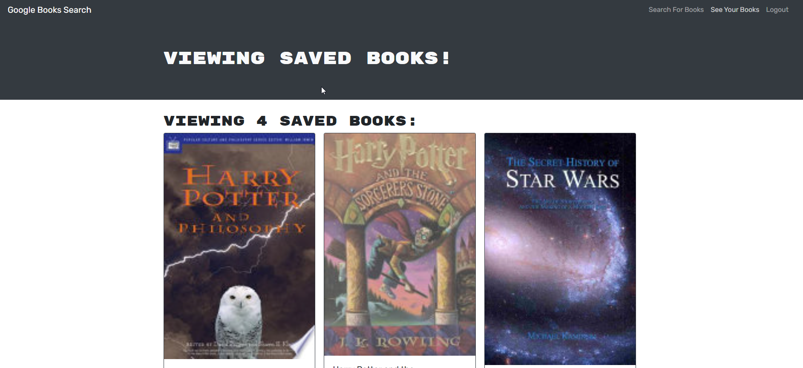

 # Book Search Engine 

  ## About/Description

  This is a book search engine that uses the Google book api to pull book information.  The starter code of the project provided a working application and the purpose of the project was to replace the RESTful API with a GraphQL API and use Apollo Provider to modify existing middleware to enable the use of JWT.  The application was then redeployed with Heroku.

  Live Link: https://whispering-brushlands-31267.herokuapp.com/ 

  ## Table of Contents

  * [Installation](#installation)
  * [Usage](#usage)
  * [Languages](#languages)
  * [Contributing](#contributing)
  * [License](#license)
  * [Tests](#tests)
  * [Questions](#questions)
  
  ## Installation

  no special instructions to install this application.  Hosted on Heroku.

  ## Usage

  ### Screenshots of Application in Use

  #### User is logged in and searches for a book

  

  #### User's saved books

  

  #### Login/Signup Modal which had functionality changed

  

  ## Languages

  JavaScript Bootstrap React MongoDB GraphQL

  ## Contributing

  Contributions by: David Shaw, start code from U of U bootcamp

  If you would like to contribute to this project we follow the [Contributor Covenant](https://www.contributor-covenant.org/)

  ## License

  https://choosealicense.com/licenses/mit/

  ## Tests

  none

  ## Questions:

  If you have any questions please contact us or refer to our github below:

  Email Us At: david.shaw1242@gmail.com

  Github Repo: https://github.com/ds1242/book-search-engine

